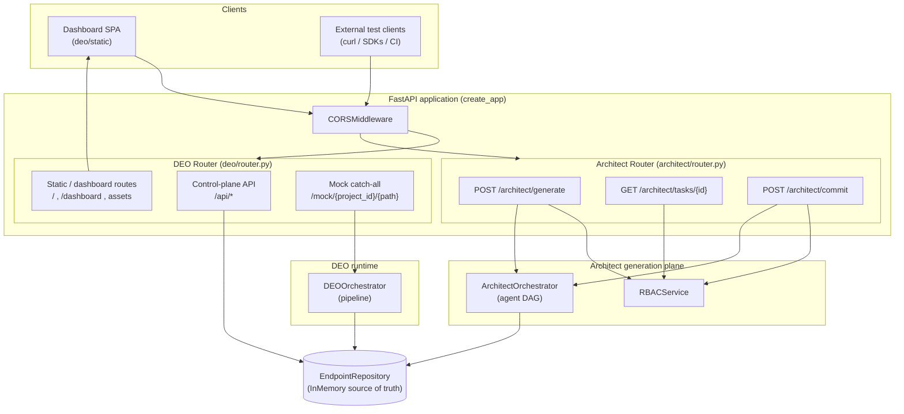
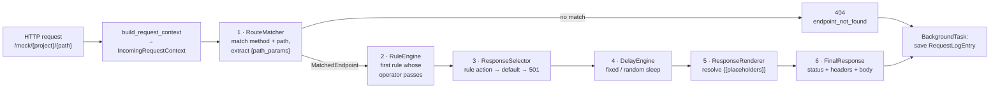
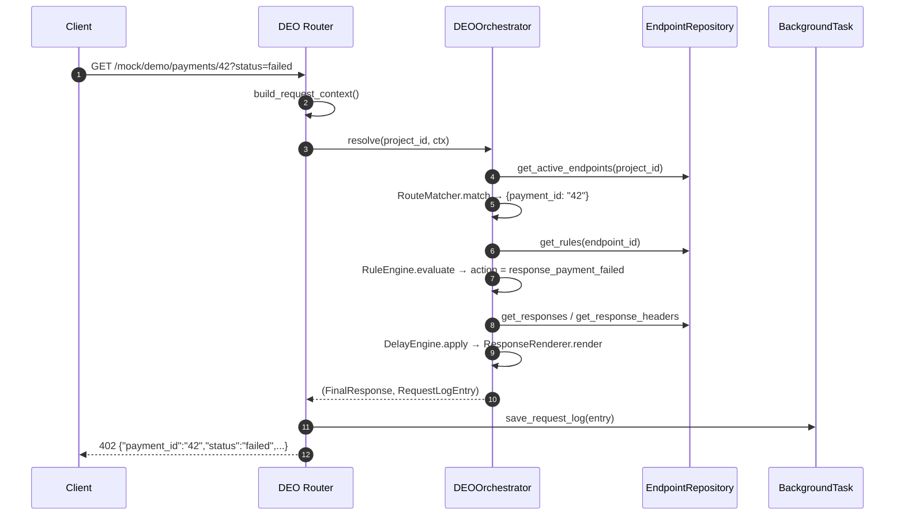
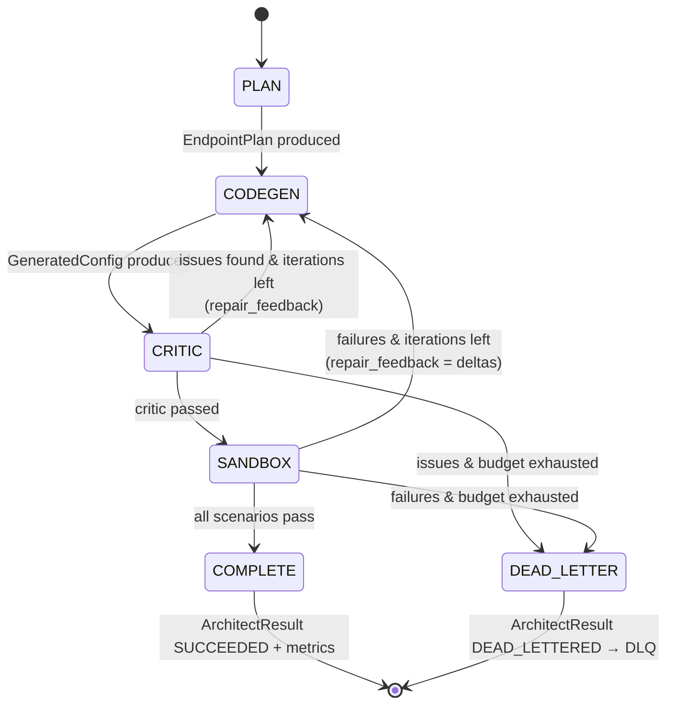
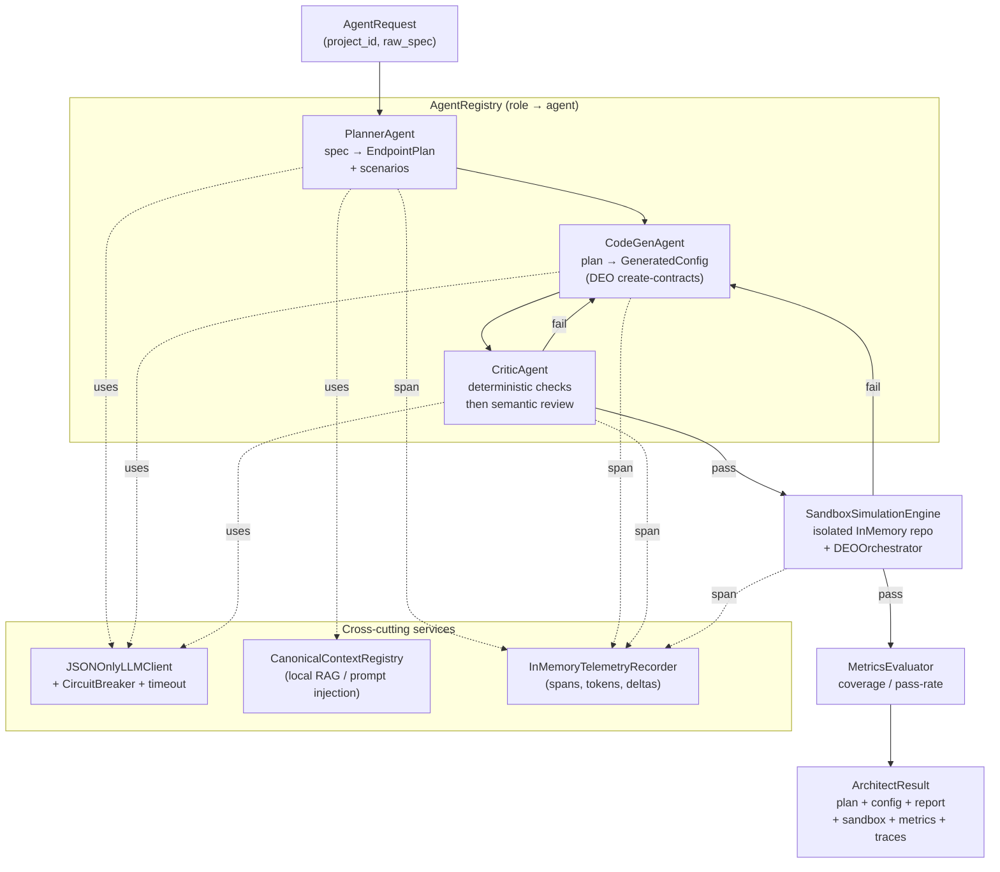
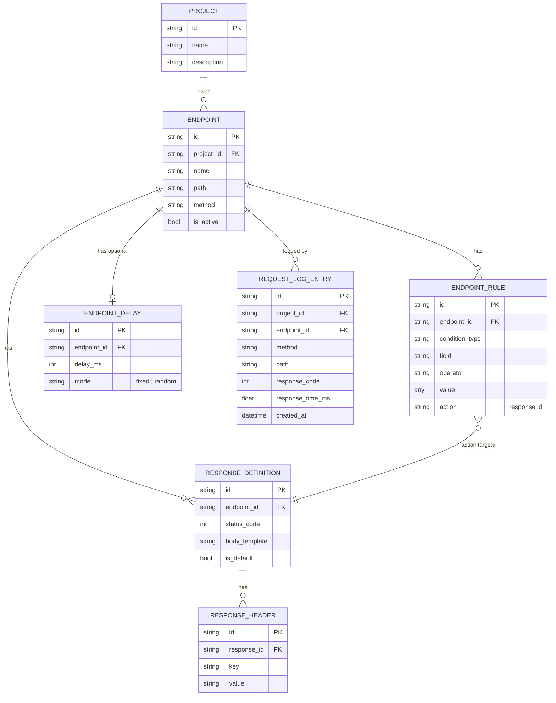

# MockMesh — Dynamic Endpoint Orchestrator (DEO) & AI Endpoint Architect

MockMesh is a **programmable mock-API platform**. You define virtual HTTP endpoints (method, path, conditional rules, latency, and templated responses), and the platform serves them under a catch-all route so that client applications can be tested against realistic, configurable backends. On top of the runtime, an **AI Endpoint Architect** turns a plain-English API specification into validated, sandbox-tested endpoint configurations and (optionally) commits them to the live system.

The project is made of two cooperating Python packages plus a single-page control-plane dashboard:

| Package | Responsibility |
| --- | --- |
| `deo/` | The **runtime**. Resolves every incoming mock request through a deterministic pipeline (route → rules → response → delay → render), and exposes the control-plane REST API + dashboard. |
| `architect/` | The **generation plane**. A multi-agent DAG workflow (Planner → CodeGen → Critic → Sandbox) that authors and verifies new endpoint configurations from natural language, reusing `deo` contracts as the source of truth. |
| `deo/static/` | The **dashboard** — an HTML/CSS/JS single-page app that talks to the REST API. |

---

## 1. Table of contents

1. [Technology stack](#2-technology-stack)
2. [System architecture](#3-system-architecture)
3. [DEO request-resolution pipeline](#4-deo-request-resolution-pipeline)
4. [AI Endpoint Architect agent workflow](#5-ai-endpoint-architect-agent-workflow)
5. [Data model (database)](#6-data-model-database)
6. [API reference](#7-api-reference)
7. [Security & RBAC](#8-security--rbac)
8. [Observability & resilience](#9-observability--resilience)
9. [Module / file map](#10-module--file-map)
10. [Running, deploying & testing](#11-running-deploying--testing)

---

## 2. Technology stack

| Concern | Choice |
| --- | --- |
| Language | Python **3.11+** (uses `enum.StrEnum`, PEP 604 unions) |
| Web framework | **FastAPI** (`>=0.115`) with `CORSMiddleware` |
| Data contracts | **Pydantic v2** (`>=2.0`) — every record and DTO is a `BaseModel` |
| ASGI server | **uvicorn** (`>=0.30`), run via the `--factory` flag |
| HTTP client | **httpx** (`>=0.27`) — available for live LLM transports |
| Persistence | **In-memory repository** (`InMemoryEndpointRepository`) behind an abstract `EndpointRepository` interface |
| Deployment | **Railway** (`railway.json`), `uvicorn deo.router:create_app --factory` |

A key design property: there is **no database driver**. All state lives in memory behind the `EndpointRepository` abstraction, so the same code can later be backed by Postgres/Redis without touching the pipeline or agents. The "database" section below documents the logical schema this abstraction implies.

---

## 3. System architecture

At the top level, a browser-based dashboard and external test clients talk to one FastAPI application. That app mounts two routers — the **DEO router** (control plane + mock catch-all) and the **Architect router** (AI generation) — and both share a single `EndpointRepository` instance as the source of truth.



### How the pieces connect

- **`create_app()`** (`deo/router.py`) builds the FastAPI app, attaches permissive CORS, includes the DEO router, and calls `_include_architect_router()` to mount the architect routes against the **same** repository instance. A standalone equivalent factory also lives in `architect/app.py`.
- The **DEO router** serves three concerns from one module: the static dashboard, the JSON control-plane API (`/api/...`) used by the dashboard, and the wildcard `/mock/{project_id}/{full_path:path}` route that actually emulates the configured endpoints.
- The **Architect router** is RBAC-protected and asynchronous: `generate` queues a background task and returns a `task_id`; the dashboard polls `tasks/{id}`; `commit` promotes a successful result into the live repository.
- The **repository** is the single integration seam. The DEO pipeline reads from it on every request; the architect writes to it only on an explicit commit. This is why generated endpoints become instantly live without redeployment.

---

## 4. DEO request-resolution pipeline

Every call to `/mock/{project_id}/{...}` is normalized into an `IncomingRequestContext` and pushed through six deterministic stages by `DEOOrchestrator.resolve()`. Request logging happens **asynchronously** via FastAPI `BackgroundTasks`, so logging never adds latency to the response.



### Stage-by-stage detail

1. **Route matching** (`route_matcher.py`). Splits both the request path and each active endpoint path into segments. A `{param}` segment matches any single segment and is captured into `path_params`. When several endpoints match, the one with the **most static (non-parameter) segments wins** — so `/refunds/{id}/status` beats a hypothetical `/refunds/{id}/{action}`. Method must match exactly.
2. **Rule evaluation** (`rule_engine.py`). Rules are evaluated **in repository order**; the **first** rule whose operator returns `True` wins and supplies an `action`. Operators live in an extensible `OPERATOR_REGISTRY`: `equals`, `not_equals`, `contains`, `exists`, `gt`, `lt`, `regex`. The compared value is pulled from the request via dotted-path lookup against `query`, `headers`, `body`, `path`, or the whole `request`.
3. **Response selection** (`response_selector.py`). Resolution order: the response whose id equals the rule `action` → the endpoint's `is_default` response → a deterministic **501** `response_not_configured` fallback. Configured response headers are attached here.
4. **Delay** (`delay_engine.py`). A `DELAY_STRATEGY_REGISTRY` maps modes to async strategies: `fixed` sleeps exactly `delay_ms`; `random` sleeps a uniform `0..delay_ms`. No delay configured = no wait.
5. **Rendering** (`response_renderer.py`). Replaces `{{placeholder}}` tokens in the body and headers. Supported tokens: built-in functions `{{now}}` and `{{uuid}}`; prefixed lookups `{{path.x}}`, `{{query.x}}`, `{{body.x}}` (and `path_params.`/`query_params.` aliases); and bare names searched across path params, query, then body. Missing values render as empty strings.
6. **Final response & logging**. The orchestrator builds a `FinalResponse` and a `RequestLogEntry` (capturing method, path, headers, body, status, and measured `response_time_ms`). The router persists the log on a background task.



---

## 5. AI Endpoint Architect agent workflow

The architect converts a natural-language spec (`AgentRequest.raw_spec`) into a verified `GeneratedConfig`. `ArchitectOrchestrator.execute()` drives a finite-state DAG across four agent roles, with a bounded retry budget (`max_iterations = 3`). Each transition is wrapped in a telemetry span.



### The agents



- **PlannerAgent** (`planner_agent.py`) — queries the `CanonicalContextRegistry` for naming standards and prior patterns, prompts the LLM for an `EndpointPlan`, and on any LLM failure falls back to a **regex-based planner** that scrapes `METHOD /path`, `status NNN`, `delay N`, and simple `query x == y` clauses straight from the spec. This guarantees the workflow produces output even with no live model. Metadata: temperature `0.1`, capabilities `endpoint_planning`, `scenario_generation`.
- **CodeGenAgent** (`codegen_agent.py`) — turns the plan into a `GeneratedConfig` of `EndpointCreateRequest`/`RuleCreateRequest` objects (the **same contracts** the DEO repository consumes). Deterministic (temperature `0`); has a structural fallback that maps plan items directly to create-requests, and accepts `repair_feedback` for retry rounds.
- **CriticAgent** (`critic_agent.py`) — a **hybrid** validator. First runs **deterministic** checks (duplicate `method+path` signatures, unsupported delay modes against `DELAY_STRATEGY_REGISTRY`, rules pointing at unknown endpoint keys, operators absent from `OPERATOR_REGISTRY`). Only if those pass does it run an optional **semantic** LLM review. Deterministic failures short-circuit and feed `repair_feedback` back to CodeGen.
- **SandboxSimulationEngine** (`sandbox.py`) — spins up a **fresh, empty `InMemoryEndpointRepository`**, materializes the generated endpoints/rules, and replays every `IntegrationScenario` through a real `DEOOrchestrator`. Each case compares actual vs. expected status code and required body fragments, producing `deltas`. This is true behavioral verification, not just static linting.
- **MetricsEvaluator** (`sandbox.py`) — on success computes `specification_coverage`, `parameter_mapping_accuracy`, `path_parsing_match_rate`, `simulation_pass_rate`, and `iterations`.

### Supporting infrastructure

- **`JSONOnlyLLMClient`** (`llm_client.py`) — the single seam for all model calls. It enforces a timeout, records token counts via telemetry, and is fronted by a **`CircuitBreaker`** that opens after 3 consecutive failures. With no transport configured it fails cleanly (so the deterministic fallbacks engage) instead of making a network call.
- **`CanonicalContextRegistry`** (`context.py`) — a local stand-in for a vector store: keeps per-project naming standards, standard objects, and previous endpoint patterns, and does keyword filtering against the spec to inject the most relevant prior patterns.
- **`InMemoryTelemetryRecorder`** (`telemetry.py`) — `span()` context managers emit `AgentStepTrace` records (latency, prompt/response tokens, state delta), collected into `ArchitectResult.traces`.
- **`DeadLetterQueue`** — failed or budget-exhausted runs are appended for later inspection.
- **`discovery.py`** — a "Phase 0" introspection helper that reports the live DEO contracts (model fields, repository methods, operator/delay registries) so the architect stays aligned with the runtime.

### Commit path

After a `SUCCEEDED` task, `POST /architect/commit` calls `ArchitectOrchestrator.commit()`, which creates each generated endpoint **only if its `method+path` signature does not already exist**, remaps architect-local endpoint keys to real repository ids, then creates the associated rules. It returns counts of committed endpoints and rules.

---

## 6. Data model (database)

State is held in memory, but it follows a clear relational shape. A **Project** owns **Endpoints**; each endpoint owns ordered **Rules**, configurable **Responses**, an optional **Delay**, and accumulates **Request logs**. Each response owns **Response headers**. Rules point to a response via their `action` field. The diagram below models these entities and relationships as the logical schema implemented by `InMemoryEndpointRepository`.



### Entity notes

- **Project** (`ProjectOverview`) — seeded with `demo`, `checkout-lab`, `refunds-qa`. Projects are the tenancy/scoping unit for endpoints, rules, logs, and RBAC.
- **Endpoint** — identified by a unique `project_id + method + path` signature (enforced by `endpoint_signature_exists`). `is_active=false` hides it from route matching.
- **EndpointRule** — `condition_type ∈ {query, headers, body, path, request}`, `operator ∈ {equals, not_equals, contains, exists, gt, lt, regex}`. The opaque `action` is interpreted by the response selector as the target response id.
- **ResponseDefinition** — `status_code` constrained to 100–599; `body_template` may contain `{{...}}` placeholders; exactly one is typically `is_default`.
- **EndpointDelay** — at most one per endpoint; `delay_ms ≥ 0`; `mode ∈ {fixed, random}`.
- **RequestLogEntry** — append-only audit record with a generated UUID and UTC timestamp; surfaced to the dashboard as `RequestLogOverview` (most recent first, capped at 200).

> **Seed data** (`InMemoryEndpointRepository.__init__`): the `demo` project ships `GET /payments/{payment_id}` (with a `status==failed → 402` rule), `POST /payouts` (650 ms fixed delay, 202), and `GET /health`; `checkout-lab` ships `POST /cards`; `refunds-qa` ships `GET /refunds/{refund_id}/status`.

### Architect-side models

The generation plane has its own transient models (not persisted to the repository unless committed): `AgentRequest`, `EndpointPlan` (with `PlannedEndpoint`, `PlannedRule`, `IntegrationScenario`), `GeneratedConfig` (with `GeneratedEndpointConfig`, `GeneratedRuleConfig`), `CriticReport`/`CriticIssue`, `SandboxTestResult`/`SandboxCaseResult`, `ArchitectMetrics`, `AgentStepTrace`, and the task/result wrappers `ArchitectTask` and `ArchitectResult`. Their lifecycle states are `TaskStatus ∈ {queued, running, succeeded, failed, dead_lettered}`.

---

## 7. API reference

### Control plane & dashboard (DEO router)

| Method | Path | Purpose |
| --- | --- | --- |
| GET | `/` | Redirects to `/dashboard` |
| GET | `/dashboard` | Serves the dashboard SPA |
| GET | `/dashboard/assets/{name}` · `/{name}` | Serves `dashboard.css` / `dashboard.js` |
| GET | `/api/projects` | List projects |
| POST | `/api/auth/login` | Demo login → user, token (`dev-admin`), project options |
| GET | `/api/projects/{project_id}/endpoints` | List endpoint overviews |
| POST | `/api/projects/{project_id}/endpoints` | Create endpoint (+ default response, optional delay); `409` on duplicate signature |
| POST | `/api/projects/{project_id}/endpoints/check` | Check whether a method/path resolves; returns match + delay info |
| GET | `/api/projects/{project_id}/rules` | List rule overviews |
| POST | `/api/projects/{project_id}/rules` | Create a rule + its response action; `404` if endpoint missing |
| GET | `/api/projects/{project_id}/logs?limit=` | Recent request logs (1–200) |
| `*` | `/mock/{project_id}/{full_path:path}` | The mock catch-all (GET/POST/PUT/PATCH/DELETE) |

### Generation plane (Architect router, prefix `/architect`)

| Method | Path | Purpose | Roles |
| --- | --- | --- | --- |
| POST | `/architect/generate` | Queue a generation task → `{task_id, status}` (202) | `architect`, `admin` |
| GET | `/architect/tasks/{task_id}` | Poll task state / result | `architect`, `admin`, `viewer` |
| POST | `/architect/commit` | Commit a succeeded result to the live repo | `architect`, `admin` |

---

## 8. Security & RBAC

The architect routes are guarded by **`RBACService`** (`architect/security.py`):

- **Authentication** — reads the `Authorization: Bearer <token>` header and maps it to a `Principal`. With no header it defaults to the built-in `dev-admin` principal (development convenience). An unknown token → `401`.
- **Authorization** — `Principal.has_role(project_id, allowed_roles)` enforces **project-scoped** roles. The seeded `dev-admin` holds `architect`/`admin`/`viewer` on all three demo projects. Missing the required role → `403`.
- **Tenant isolation** — every architect operation is scoped to a `project_id`, and commits respect existing endpoint signatures so generation cannot silently overwrite live configuration.

> The DEO control-plane `/api/*` routes use a lightweight demo login (`token = "dev-admin"`) rather than RBAC enforcement; production hardening would put the same RBAC in front of those routes.

---

## 9. Observability & resilience

- **Telemetry** — `InMemoryTelemetryRecorder.span()` wraps every agent step and LLM call, capturing latency, token estimates, and a summarized state delta into `AgentStepTrace` records returned on `ArchitectResult.traces`. The recorder is swappable for OpenTelemetry without touching agent code.
- **Circuit breaker** — `JSONOnlyLLMClient` opens its breaker after 3 consecutive LLM failures, preventing cascading downstream calls; a success resets it.
- **Bounded retries + DLQ** — the architect DAG retries CodeGen up to 3 iterations on critic/sandbox failure, then dead-letters the run into the `DeadLetterQueue` with a descriptive error.
- **Graceful degradation** — Planner, CodeGen, and Critic all have deterministic fallbacks, so the workflow yields a usable result even with no LLM transport configured.
- **Non-blocking logging** — request logs are written on FastAPI background tasks, keeping the mock hot path fast.

---

## 10. Module / file map

```
DynamicEndpointOrch/
├── railway.json              # Railway deploy: uvicorn deo.router:create_app --factory
├── requirements.txt          # fastapi, pydantic, uvicorn, httpx
├── deo/                       # ── RUNTIME ──
│   ├── router.py             # FastAPI app factory, control-plane API, mock catch-all
│   ├── orchestrator.py       # DEOOrchestrator.resolve() — the 6-stage pipeline
│   ├── route_matcher.py      # Stage 1: method/path match + {param} extraction
│   ├── rule_engine.py        # Stage 2: ordered rule eval + OPERATOR_REGISTRY
│   ├── response_selector.py  # Stage 3: action → default → 501 fallback
│   ├── delay_engine.py       # Stage 4: fixed/random DELAY_STRATEGY_REGISTRY
│   ├── response_renderer.py  # Stage 5: {{placeholder}} templating
│   ├── repository.py         # EndpointRepository + InMemoryEndpointRepository + seed data
│   ├── models.py             # All Pydantic records & DTOs
│   └── static/               # dashboard.html / .css / .js (SPA control plane)
├── architect/                # ── GENERATION PLANE ──
│   ├── orchestrator.py       # ArchitectOrchestrator — agent DAG, retries, commit, DLQ
│   ├── router.py             # /architect/* protected routes
│   ├── planner_agent.py      # spec → EndpointPlan (LLM + regex fallback)
│   ├── codegen_agent.py      # plan → GeneratedConfig (DEO create-contracts)
│   ├── critic_agent.py       # deterministic + semantic validation
│   ├── sandbox.py            # SandboxSimulationEngine + MetricsEvaluator
│   ├── llm_client.py         # JSONOnlyLLMClient + CircuitBreaker
│   ├── context.py            # CanonicalContextRegistry (local RAG)
│   ├── registry.py           # AgentRegistry + BaseAgent + AgentMetadata
│   ├── telemetry.py          # InMemoryTelemetryRecorder + spans
│   ├── security.py           # RBACService + Principal auth
│   ├── discovery.py          # Phase-0 DEO contract introspection
│   ├── models.py             # Architect Pydantic contracts
│   └── app.py                # Standalone app factory (DEO + architect)
└── tests/                    # pytest suite (pipeline, rules, rendering, architect workflow)
```

---

## 11. Running, deploying & testing

### Local development

```bash
pip install -r requirements.txt
# Serve DEO + dashboard + architect (factory style):
uvicorn deo.router:create_app --factory --reload --port 8000
# then open http://127.0.0.1:8000/dashboard
```

`architect/app.py:create_app` is an equivalent standalone factory exposing both routers.

### Deployment (Railway)

`railway.json` runs:

```
uvicorn deo.router:create_app --host 0.0.0.0 --port ${PORT:-8000} --factory
```

Because the app is fully in-memory, each instance is stateless across restarts and does not require provisioned storage — suitable for ephemeral preview environments, with the repository interface ready to swap in durable storage later.

### Testing

The `tests/` suite exercises the pipeline and the agent workflow:

| Test file | Covers |
| --- | --- |
| `test_orchestrator.py` | End-to-end DEO resolution, control-plane API, mock catch-all |
| `test_route_matcher.py` | Path matching & parameter extraction, specificity |
| `test_rule_engine.py` | Operator behavior & dotted-path extraction |
| `test_response_renderer.py` | `{{placeholder}}` rendering |
| `test_architect_workflow.py` | Planner→CodeGen→Critic→Sandbox DAG, retries, commit |

```bash
pip install pytest pytest-asyncio
pytest -q
```
